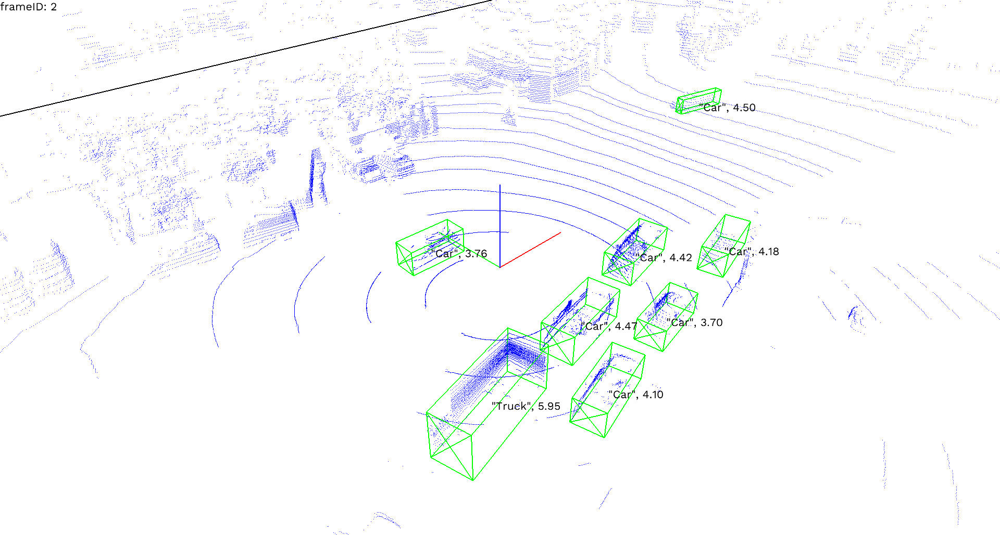

# Simple KITTI Point Cloud Viewer



## Usage

To show the point cloud and labels of a KITTI dataset (in `./kitti` for
example),

```bash
cargo run --release -- --kitti-dir ./kitti
```

To record the point cloud data play,

```bash
cargo run --release --          \
    --kitti-dir ./kitti         \
    --screencast-dir screencast \
    --play-on-start             \
    --record-on-start
```

## Hotkeys

- **R**: Toggle recording
- **I**: Show intensity text
- **Space**: Play/Pause
- **←**: Go to the previous frame
- **→**: Go to the next frame
- **Esc**: Exit
